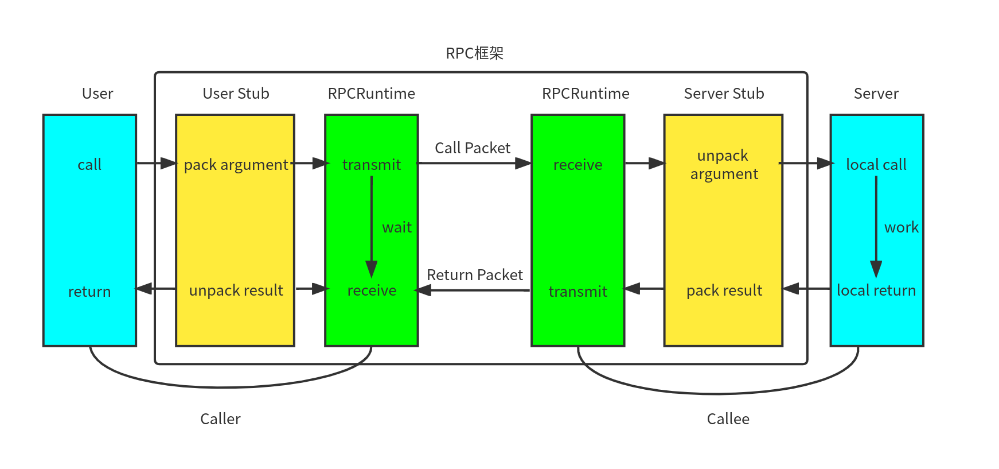

## 使用C++开发RPC框架
RPC(**R**emote **P**rocedure **C**all)框架使得远端的一个进程可以调用远端另一个进程所提供的方法，是构建分布式系统的基础通信协议。本项目使用了C++开发了一个RPC框架所需要的各个模块。
### RPC框架原理
#### 集群与分布式
假如我们现有一个数独求解服务器，包含了登录服务模块、计算求解模块与后台管理模块。开始时候数独求解服务器部署在单机上，但随着用户的增多与请求计算量的增多，单机环境撑不住高并发的要求了。这个时候集群与分布式的部署架构就可以起到作用了。
##### 集群
集群方式是将服务器部署到了多台机器上，每一台机器上都是独立的服务器。再通过负载均衡服务器进行管理，供用户使用，由此大大增加了服务器的并发负载量。这种部署方式比较简单，并且切实的提高了服务器的并发量。
集群方式也有很多问题:
* 当服务器的一个模块需要修改时，所有服务器都需要重新编译，重新部署，维护起来比较麻烦。    
* 另外服务器中有些模块是属于CPU密集型的，有些是属于I/O密集型的，造成各模块对硬件资源的需求是不一样的（这个问题单机也有）。例如前文提到的数独求解服务器，显然计算求解模块是CPU密集的，需要CPU性能强的机器，而登录服务模块可能是I/O密集的，可能需要内存更强大的机器。

为了解决以上问题，成熟的服务器更多使用了分布式的架构
##### 分布式
分布式架构支持分模块部署服务器，例如将数独服务器的计算模块部署到一个CPU强的机器上（不一定是一个，可以单独对模块进行集群部署），将登录模块部署到内存大的机器上。如此分模块运行在不同机器的docker虚拟化环境中，属于不同的进程，分布在不同机器的各个模块共同构成了高性能的服务器。由此，集群的两个问题都可以得到解决。
但是大系统的的软件模块该怎么划分呢，也许有些模块的某段代码很多模块都需要调用，此时会导致模块间有大量的重复代码。为了解决这个问题，就必须有一个通信协议，可以让机器1上的模块调用机器2上模块的方法。至此，就产生了RPC通信框架。
#### RPC框架通信过程
RPC本质是个通信框架，要发布RPC方法的模块可以叫做RPC服务提供端，调用此RPC方法的模块可以叫做RPC客户端。由于提供端与客户端分属于不同的进程乃至不同的机器，那么必定是需要通过网络进行通信，并且需要是可靠的网络。
RPC的通信框架如下图所示：

图中蓝色方框的User与Server是RPC框架的使用者，User是RPC客户端，调用Server发布的RPC远程方法。中间方框圈住的四个模块是本项目实现的RPC框架。其中黄色模块是将使用者发送/接受的消息进行序列化与反序列，绿色部分是Socket通信部分，将序列化后的消息发送给对端。
### RPC框架实现
RPC框架的实现需要解决三个部分的问题：
1.  **调用映射**。调用者调用远程远端RPC方法Login时，RPC框架如何找到远端对应的Login方法而不是Register方法呢。这需要RPC框架建立一个对应表。在本项目中，建立了{server_name : ServerInfo}的对应表，ServerInfo中包含有Server对象，以及{method_name : MethodDescriptor}，这样可以先通过解析server_name得到我们要连接的server的ip与端口，再通过method_name得到要调用的函数。
2.   **序列化与反序列化**。 调用函数往往都是需要给参数的,在本地函数调用中，参数是直接被系统压栈，相当于是放到了内存里。而远程调用不属于一个机器，不能通过内存来传递参数。这时候需要RPC客户端将参数序列化为字节流，传给RPC提供方，再进行反序列化，得到参数。同理，返回的结果也需要经过序列化与反序列化的过程。 在本项目中，对于序列化与反序列化，使用了Protobuf。Protobuf字节流是用二进制存储的，对比json与xml这种文本存储的形式读取起来会更加迅速。并且Protobuf提供了很完备的RPC服务接口，很方便通过.proto文件生成服务器与客户端需要的RPCService类与Stub类。
3. **网络传输**。从之前讲的整体框架中就可以知道，RPC的调用是远程的，那么就离不开网络传输。RPC客户端与服务器之间的调用传参与返回都需要经过网络的传输。网路传输层需要将RPC客户端序列化后的请求发送到RPC服务端，RPC服务端完成响应后也需要将序列化后的结果通过网络传输发给RPC客户端。在本项目中，网络传输使用了muduo库来完成，muduo库是由陈硕开发的linux多线程网络库，使用的是reactors in threads - one loop per thread模式，支持多线程，高并发。

具体的，框架主要类包含如下图

其中，MyRpcProvider类为service的stub类，主要包含：
1. NotifyService函数用于注册服务，完成映射表的建立
2. 监听连接与消息，收到Request后进行反序列化
3. 调用本地服务，获取返回值
4. 设置回调，完成服务后将结果序列化为Response发给client

MyRpcChannel类为客户端的stub类，继承自Protobuf生成的RpcChannel类，主要包含：
1. 将Rpc请求序列化为Request发出
2. 等待响应
3. 接收到Response后进行反序列化
   
### 日志模块实现
作为库日志模块一般都是不可或缺的。对于本项目，RPC服务器是要并发接受很多请求的（epoll+多线程），是在多线程环境下的，所以可能会有多个线程同时进行写日志信息。所以不可以直接让多个线程直接操作文件进行写。本项目以queue为底层数据库做了一个线程安全的消息队列（使用互斥锁与条件变量），写日志时先将日志放入消息队列中，再有专门的写日志进程读取消息队列中的日志，并将其写入文件中。这要求日志类需要是单例，在构造函数中创建此唯一的写日志进程。

### zookeeper服务注册中心
在此前，我们没有说调用端如何知道服务端的ip与port的。最简单的方法是使用配置文件进行获取，但是当服务端为了高并发，对模块也进行了集群部署时，配置文件是静态的，如果服务提供者发生变化，例如某台挂掉了，或者新增加了机器，都需要手工修改配置文件，非常的不方便，这种现象叫客户端与服务提供者的紧耦合。为了解决这个问题，需要引入一个中间层--注册中心。服务提供者将服务都在配置中心进行注册，当客户端请求时，从注册中心拿到对应服务的url。这样的话，不管是发生什么变化，都可以在注册中心反映出来，不用去维护静态的配置文件。zookeeper就是这样的服务注册中心，本项目就使用了zookeeper作为解除客户端与服务器耦合的工具。

### 总体流程

